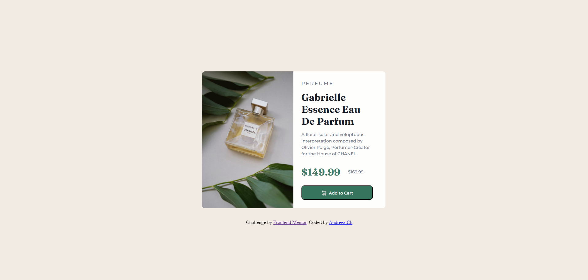
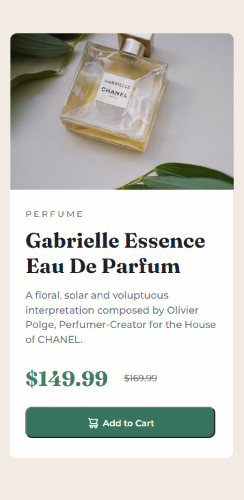

# Frontend Mentor - Product preview card component solution

This is a solution to the [Product preview card component challenge on Frontend Mentor](https://www.frontendmentor.io/challenges/product-preview-card-component-GO7UmttRfa). Frontend Mentor challenges help you improve your coding skills by building realistic projects. 

## Table of contents

  - [Overview](#overview)
  - [The challenge](#the-challenge)
  - [Screenshot](#screenshot)
  - [Links](#links)
  - [My process](#my-process)
  - [Built with](#built-with)
  - [Other tools used](#other-tools-used)
  - [What I learned](#what-i-learned)
  - [Useful resources](#useful-resources)


## Overview

### The challenge

Users should be able to:

- View the optimal layout depending on their device's screen size
- See hover and focus states for interactive elements

### Screenshot

![]
![]


### Links

- Solution URL: [https://github.com/npc-makinika/Product-preview-card-component.git](https://github.com/npc-makinika/Product-preview-card-component.git)
- Live Site URL: [https://npc-makinika.github.io/Product-preview-card-component/](https://npc-makinika.github.io/Product-preview-card-component/)

## My process

### Built with

- Semantic HTML5 markup
- CSS custom properties
- Flexbox
- CSS Grid
- Mobile-first workflow


### Other tools used:
- Pesticide extension -> this is perfect to outline eacth element to better see the placement on the page  
- Developer tools -> available on any browser and is ideal for experimenting with changes to your page without affecting your code
- Imagecolorpicker -> used to choose a color and obtain the corresponding HTML Color Code for the selected pixel of an uploaded picture
- Convertingcolors -> perfect for converting colors and getting all the details about the converted color


### What I learned

1. Employing the button::before pseudo-element to embed an icon into a button, arranging the elements to be inline and applying additional styling:
```css
button::before {
    content: url('images/icon-cart.svg'); /* inserting icon */
    color: hsl(30, 38%, 92%);
    display: inline-block;
    width: 20px; /* Adjust icon width as needed */
    height: 20px; /* Adjust icon height as needed */
    margin-right: 5px; /* Adjust spacing between icon and text */
    position: relative; /* Ensure positioning is relative to the button */
    top: 3px; /* Adjust vertical position */
}
```

2. Utilizing max-width and max-height to ensure an image remains within its container:
```css
img {
    max-width: 100%; 
    max-height: 100%;
}
```


3. Employing display: flex; to align two containers on the same line and wrapping the content to maintain cohesion, particularly beneficial for mobile view:
```css
.content {
    display: flex; 
    flex-wrap: wrap;
    justify-content: center; 
}
```

5. Applying a filter property to adjust the brightness of an image:
```css
.content-pic {
    filter: brightness(95%);
}
```

6. Using text-decoration to alter the text style:
```css
.old-price {
text-decoration: line-through;
}
```

7. Utilizing position: relative; to align text with its preceding element, new-price:
```css
.old-price {
position: relative;
    top: -7px;
}
```
8. Utilizing media queries to swap images for mobile views:
```css
@media (max-width: 767px) {
img {
content: url('images/image-product-mobile.jpg');
 }
}
```

9. Concealing the footer in mobile view:
```css
@media only screen and (max-width: 768px) {
    footer {
      display: none;
    }
}
```


### Useful resouces

- [Example resource 1](https://developer.mozilla.org/en-US/) - This resource proved valuable to me when I had to search for specific HTML or CSS elements for my project. I highly recommend this site to anyone looking to initiate their learning journey in HTML and CSS. It also offers a comprehensive set of learning materials tailored for novice developers and students.

- [Example resource 2](https://imagecolorpicker.com/) - This is perfect if you want to extract colors from images.

- [Example resource 3](https://convertingcolors.com/) -  Useful for converting between various color formats such as HSL, RGB, and more. Additionally, it offers a range of other color related tools and apps to assist in various tasks.

- [Example resource 4](https://www.w3schools.com/) - This is additionally valuable for refining coding skills, and the "try me" section is beneficial if you wish to observe the code in action.

- [Example resource 5](https://www.cssmatic.com/border-radius) - Helpful for experimenting and generating CSS styles such as border radius, box shadow, and more.

- [Example resource 6](https://stackoverflow.com/) - A good platform where developers can ask questions, provide answers, and engage in discussions related to programming and software development.

- [Example resource 7](https://www.geeksforgeeks.org/how-to-darken-an-image-using-css/) - Useful platform that offers a vast collection of tutorials, practice problems, interview tutorials, articles, and courses, covering various domains of computer science.


